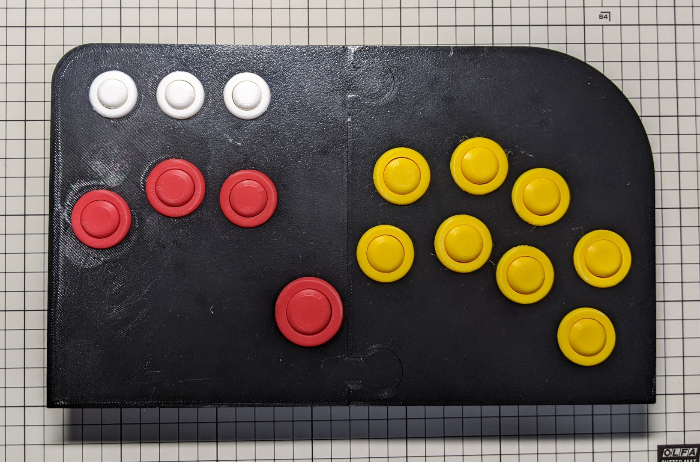
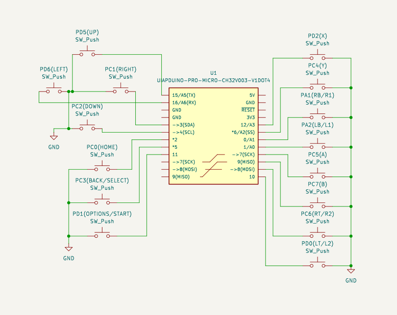
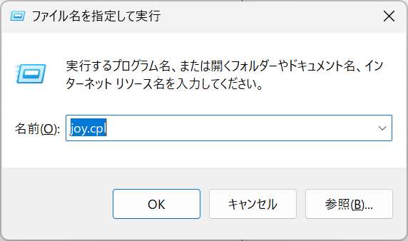
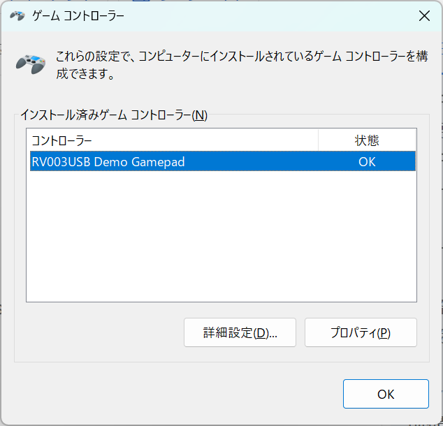
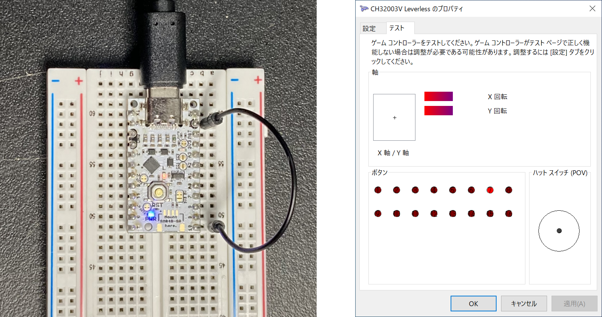
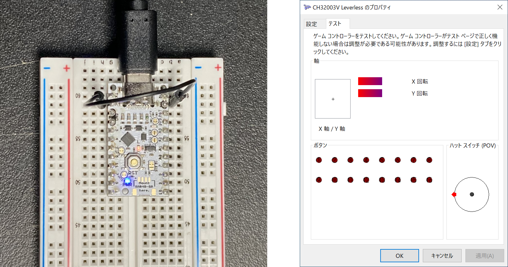
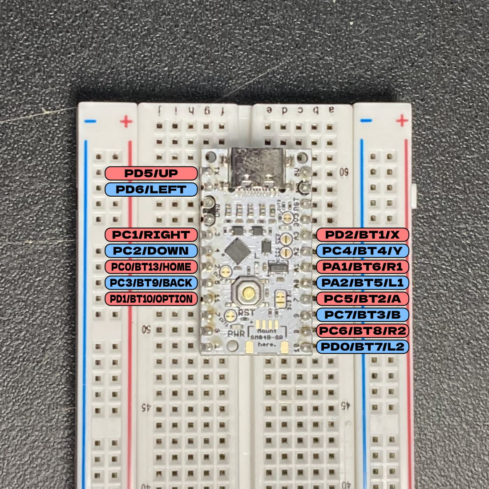

[English](README.md) | [Japanese](README.ja.md)
# Leverless on UIAPduino

## Overview
Leverless on UIAPduino is an implementation of a USB HID game controller for [UIAPduino](https://www.uiap.jp/uiapduino/pro-micro/ch32v003/v1dot4).

This project is based on the demo_gamepad example from [rv003usb](https://github.com/cnlohr/rv003usb/tree/master/demo_gamepad)

 [](https://youtu.be/pFhHLlzWdBo)

## Hardware
Just connect tactile switches to the UIAPduino GPIO pins as shown in the schematic.



## 3D Model
There is an example [enclosure model](https://www.thingiverse.com/thing:7350970) but you can use your own enclosure and buttons.

## Building the Firmware
### Prerequisites
This project uses [ch32fun](https://github.com/cnlohr/ch32fun). Please install the required tools described on [this page](https://github.com/cnlohr/ch32fun/wiki/Installation) beforehand.


### Submodules
Initialize the submodules with the following command.

```
 git submodule update --init --recursive
```

### Build / Flash
Connect your WCH-LinkE to your PC and the UIAPduino board then, run the following commands

```
cd gamepad
make
```

## Test
Connect the UIAPDuino to a Windows PC and run joy.cpl.



If everything works correctly, the controller will appear.



Open the property window.

Connect GND to GPIO pins, if the firmware is working correctly, you'll see corresponding buttons being pressed in the property window.

 


